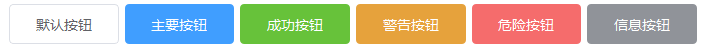
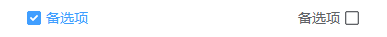
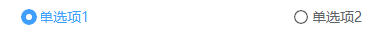
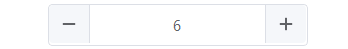
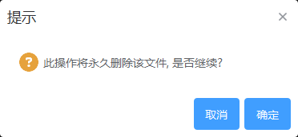
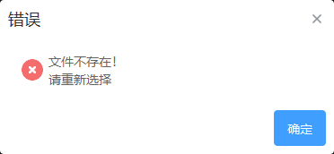

# Element3 风格 Qt Widgets

[Element3](https://e3.shengxinjing.cn/#/)，一套为开发者、设计师和产品经理准备的基于 Vue 3.0 的桌面端组件库

部分控件通过QSS方式实现，部分通过重写QWidget的paintEvent方式实现

## Button 按钮
- 默认按钮

- 圆角按钮
  

- 图标按钮

## Checkbox 多选框

## Radio 单选框

## Switch 开关

## Avatar 头像

## InputNumber 计数器

## Card 卡片

## Slider 滑块

## MessageBox 弹框

- 消息提示

- 错误提示
  

## 已实现组件

- [x] Button 按钮 
- [x] Checkbox 多选框
- [x] Radio 单选框
- [x] Input 输入框
- [x] InputNumber 计数器
- [x] Select 选择器
- [x] Link 文字链接
- [x] Switch 开关
- [x] Avatar 头像
- [x] MessageBox 弹框
- [x] Slider 滑块

  
## 未实现组件

- [ ] Progress 进度条
- [ ] Tabs 标签页
- [ ] Badge 标记
